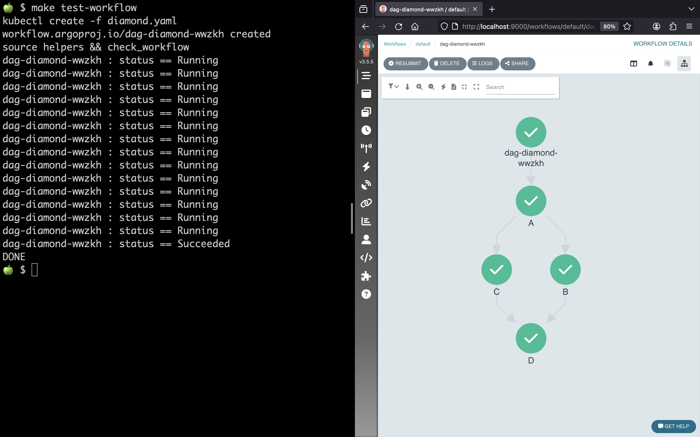

# Argo Workflows k3d Test Setup

## How-to use this?

1. make create-cluster

2. make test-workflow

3. make port-forward

4. open http://localhost:9000

## Motivation

This project shows how you can test Argo Workflows
locally, without the use of an external cluster. Instead,
we use k3d to run Argo on Docker. To test workflow
runs, simply do a `make test-workflow`.

## Requirements

- Docker, kubectl, k3d

## References

- https://k3d.io/v5.6.3/
- https://kustomize.io/
- https://argoproj.github.io/workflows/
